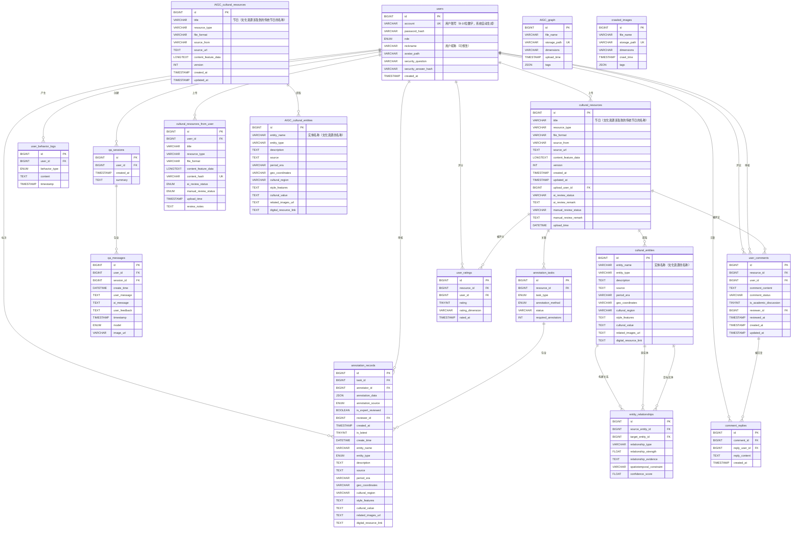

# 数据库ER图

本文档使用Mermaid格式描述数据库的实体关系图。

## ER图（Mermaid格式）

## 表说明

### 核心表

1. **users** - 用户表
   - 存储系统用户信息（管理员和普通用户）

2. **cultural_resources** - 文化资源表
   - 存储爬虫抓取或用户上传的原始文化素材
   - `title`字段：节日名称（文化资源涉及到的传统节日的名称）

3. **cultural_entities** - 文化实体表
   - 存储从资源中提取出的结构化实体信息
   - `entity_name`字段：实体名称（文化资源的名称）

4. **entity_relationships** - 实体关系表
   - 存储实体与实体之间的关系，用于构建知识图谱

### 用户行为表

5. **user_behavior_logs** - 用户行为日志表
   - 追踪用户的各类行为（检索、交互、生成、标注）

6. **qa_sessions** - 问答会话表
   - 存储AIGC过程中多轮对话的会话信息

7. **qa_messages** - 问答消息表
   - 追踪多轮对话的具体内容并收集反馈
   - 新表结构包含：user_id, user_message, ai_message, model, image_url 等字段
   - model字段标识使用的模型类型（'text' 或 'image'）
   - image_url字段仅在图片AIGC时存储生成的图片地址

### 标注相关表

8. **annotation_tasks** - 标注任务表
   - 管理标注任务

9. **annotation_records** - 标注记录表
   - 存储每条具体的标注结果，支持多人标注和专家审核

### 用户上传表

10. **cultural_resources_from_user** - 用户上传资源表
    - 用于存储用户上传、等待审核的内容

### AIGC相关表

11. **AIGC_cultural_resources** - AIGC文化资源表
    - 专门存储由AIGC生成的文化资源
    - `title`字段：节日名称（文化资源涉及到的传统节日的名称）

12. **AIGC_cultural_entities** - AIGC文化实体表
    - 存储AIGC生成的文化实体信息
    - `entity_name`字段：实体名称（文化资源的名称）

13. **AIGC_graph** - AIGC生成图像表
    - 存储AIGC生成的图像的元数据

### 爬虫相关表

14. **crawled_images** - 爬虫抓取图像表
    - 存储爬虫抓取的图像元数据

### 用户评分和评论相关表

15. **user_ratings** - 用户评分表
    - 存储用户对文化资源的评分数据
    - 支持多维度评分（综合、准确性、实用性、完整性）

16. **user_comments** - 用户评论表
    - 存储用户对文化资源的评论数据
    - 支持评论审核和学术讨论标记

17. **comment_replies** - 评论回复表
    - 存储用户对评论的回复数据

## 重要说明

1. **字段含义**：
   - `cultural_resources.title` 和 `AIGC_cultural_resources.title`：存储**节日名称**（文化资源涉及到的传统节日的名称）
   - `cultural_entities.entity_name` 和 `AIGC_cultural_entities.entity_name`：存储**文化资源名称**

2. **数据流向**：
   - 爬虫数据 → `cultural_resources` + `cultural_entities` + `crawled_images`
   - AIGC生成数据 → `AIGC_cultural_resources` + `AIGC_cultural_entities` + `AIGC_graph`
   - 用户上传数据 → `cultural_resources_from_user` → 审核通过后 → `cultural_resources`

3. **AIGC对话记录**：
   - `qa_sessions` 和 `qa_messages` 用于存储AIGC过程中的多轮对话记录

## 视图

所有表都创建了对应的只读视图（v_表名），便于统一查询与权限控制。

## 使用方法

1. **在线查看**：将Mermaid代码复制到 [Mermaid Live Editor](https://mermaid.live/) 查看
2. **Markdown渲染**：在支持Mermaid的Markdown查看器中查看（如GitHub、GitLab等）
3. **导出图片**：使用Mermaid工具导出为PNG/SVG格式

